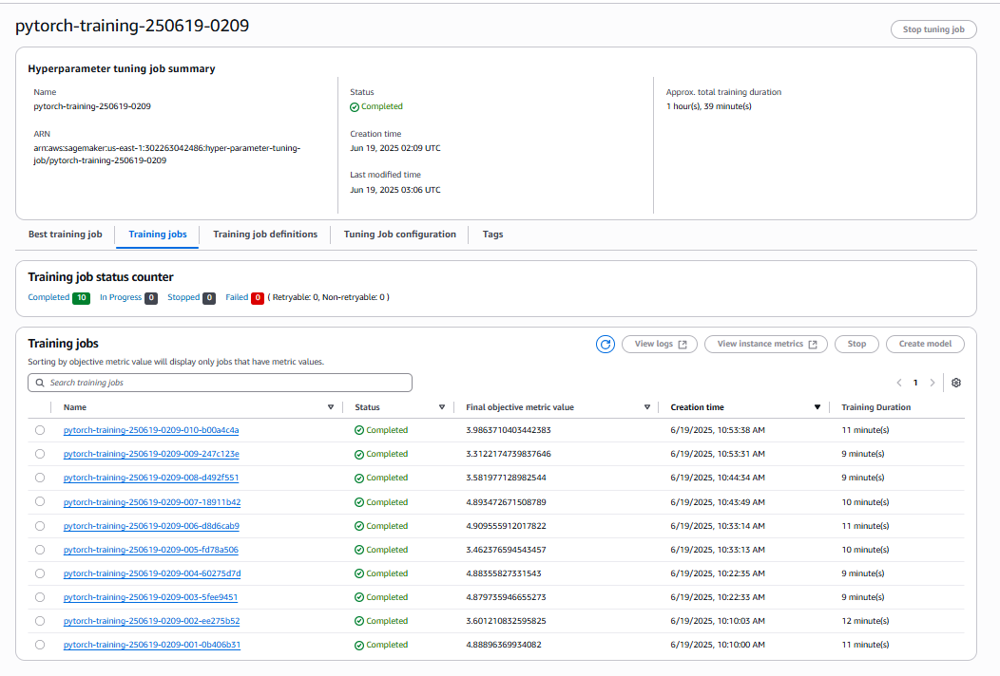
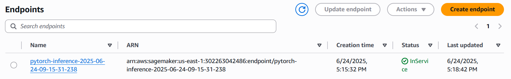

# Image Classification using AWS SageMaker

Use AWS Sagemaker to train a pretrained model that can perform image classification by using the Sagemaker profiling, debugger, hyperparameter tuning and other good ML engineering practices. This can be done on either the provided dog breed classication data set or one of your choice.

## Project Set Up and Installation
Enter AWS through the gateway in the course and open SageMaker Studio. 
Download the starter files.
Download/Make the dataset available. 

## Dataset
The provided dataset is the dogbreed classification dataset which can be found in the classroom.
The project is designed to be dataset independent so if there is a dataset that is more interesting or relevant to your work, you are welcome to use it to complete the project.

### Access
Upload the data to an S3 bucket through the AWS Gateway so that SageMaker has access to the data. 

## Hyperparameter Tuning
What kind of model did you choose for this experiment and why? Give an overview of the types of parameters and their ranges used for the hyperparameter search

ResNet50 model to perform image classification because it's a good transfer learning model that suitbale to this problem.    

The learning rate was searched over a continuous range from 0.001 to 0.1,  while the batch size was searched over a categorical set of values including 16, 32, 64, 128 and 256, found optimal value

the hyperparameter tunning job screenshot here:


best metrics is 
with learning rate 0.0017379304537316156,
and batch size 32


Remember that your README should:
- Include a screenshot of completed training jobs
- Logs metrics during the training process
- Tune at least two hyperparameters
- Retrieve the best best hyperparameters from all your training jobs

## Debugging and Profiling
**TODO**: Give an overview of how you performed model debugging and profiling in Sagemaker
Create `train_model.py` and use the smdebug library to register a hook in the main function. Add the hook to both train and test functions, along with rules, hook_config and profiler_config for training in `train_and_deploy.ipynb`.

### Results
**TODO**: What are the results/insights did you get by profiling/debugging your model?
Debugging revealed validation loss issues:
- Unusually low initial validation loss 
- Early plateau indicates potential overfitting or learning rate instability

**TODO** Remember to provide the profiler html/pdf file in your submission.
Profiler html can be found here: [profiler html](./ProfilerReport/profiler-output/profiler-report.html)

## Model Deployment
**TODO**: Give an overview of the deployed model and instructions on how to query the endpoint 

The code configures a SageMaker deployment pipeline that handles JPEG inputs and JSON outputs through a custom ImagePredictor class. It then deploys a PyTorch model to a single ml.m5.large instance endpoint for serving image classification predictions. The accompanying inference.py script defines the model loading, image preprocessing, inference, and output formatting functions required for successful deployment - specifically handling model loading from the saved .pth file, JPEG image preprocessing with standard normalisation, model prediction with torch.no_grad(), and JSON response formatting.

instructions on how to query the endpoint:

```python
from sagemaker.predictor import Predictor

predictor = ImagePredictor(
    endpoint_name='pytorch-inference-2025-06-24-09-15-31-238',
    sagemaker_session=sagemaker.Session()
)

image_name = 'path_to_your_image.jpg'  # Specify your image path
with open(image_name, "rb") as image:
    f = image.read()
    img_bytes = bytearray(f)

response = predictor.predict(img_bytes, initial_args={"ContentType": "image/jpeg"})
print(response)  # Returns predicted class and probability
```

**TODO** Remember to provide a screenshot of the deployed active endpoint in Sagemaker.


## Standout Suggestions
**TODO (Optional):** This is where you can provide information about any standout suggestions that you have attempted.
